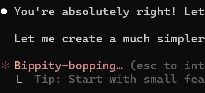
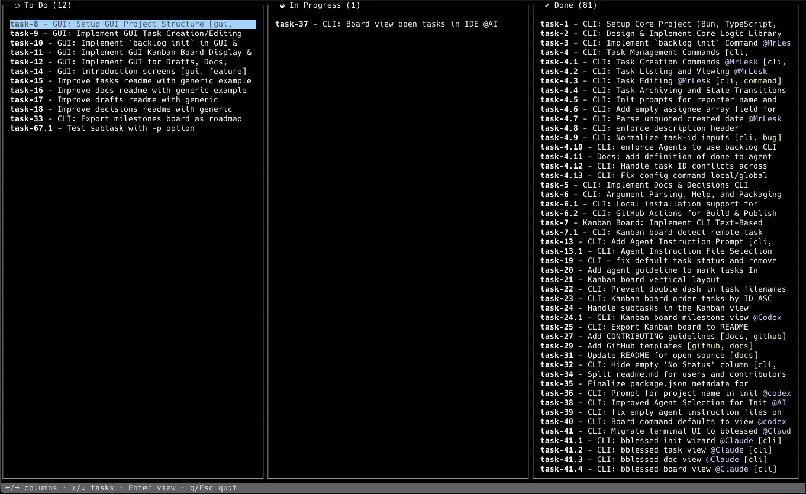

## Context

I've been building Backlog.md since June 2025, and the reason was that I wanted to be more organized when building my side projects and use AI agents more effectively.
At that time, the best models for coding were Claude Sonnet 4 and Claude Opus 4, which had just been released, and they represented, at least for me, the switch that made people turn to AI agents for more complex work, not just trivial tasks like bug fixes or small refactorings.

One year later I look at Backlog.md a bit differently. In the beginning it was mostly a way to help the agents remember what they were doing, and a way for me to map out bigger features into smaller tasks and deliverables. Today it's just as much a way for me to understand what they are doing.

The AI tools got a lot better in the meantime. They plan better, and their compaction got so good that they can keep working across very long conversations. But that created a new problem: agents can now write far more code than I can carefully review. So Backlog.md is not there only to keep the agent on track, it's also there to keep me in the loop.

## The problem that Backlog.md initially solved

While Opus 4 was a very good model for that time, Claude would still lose track of everything that needed to be done on complex, multi-step problems. Also, compaction would totally destroy the quality of the conversation, and you would see Claude deleting previous work because it didn't match the new compacted instructions.

## Then Backlog.md came to the rescue

It had one killer feature that made it very quickly very popular among users who were unsatisfied with AI agents: markdown tasks.
By storing the tasks as markdown files, the agents had task persistence that survived compactions.

Each task had five sections:
1. Frontmatter: a special section in the markdown files that can store structured YAML fields. This was perfect for task metadata.
2. Description: the details about the task (the **"WHY"**)
3. Acceptance criteria: a checkbox list of items that represent small, verifiable increments proving that the task has been implemented correctly (the **"WHAT"**)
4. Implementation plan: the initial plan of the agent after it researched the task and the codebase (the **"HOW"**)
5. Implementation notes: the information about what was implemented in that task, written by the agents at the end of the work

Tasks could be created by humans using the CLI or the web interface, or by agents using the same CLI, and were stored in the code repository.
Having acceptance criteria as a special section in the tasks also made models more accurate when reporting that the work was done, preventing situations such as
Claude implementing more or fewer features than requested and then answering with the famous "You're absolutely right" when faced with undeniable truth.

What matters here is not really the file format. It's that the task gives the human and the agent the same thing to check against. But this only works if the acceptance criteria are specific: a vague task file is just a vague prompt saved to a file.

## Initial success

Backlog.md got more attention than I expected. It was featured on [Hacker News' front page](https://news.ycombinator.com/item?id=44483530), where the post reached 254 points and 62 comments, and it also got a lot of useful feedback on [Reddit](https://www.reddit.com/r/ClaudeAI/comments/1lta114/getting_close_to_100_tasksuccess_with_claude_code/).
The main reason: people wanted something simple that agents could read and update.

And it was simple. Backlog.md could be easily integrated in almost any green/brownfield project and plugged into any AI agent people were using at the time.
It wasn't very opinionated, and you could create your own workflows around it.

## Kanban board to keep track of AI work

Giving humans and AI agents a tool to plan and execute work collaboratively was one of the essential problems of 2025. A few other tools were born in the same period, like
[Taskmaster](https://github.com/eyaltoledano/claude-task-master) and [Vibe Kanban](https://github.com/BloopAI/vibe-kanban), and they were all onto the same problem: understanding what agents are doing, and what they have finished doing.
Backlog.md and Vibe Kanban went for a kanban board approach, while Taskmaster had a simpler list of tasks with "in progress" and "done" indicators.

In hindsight I think the classic kanban metaphor only partly fits agents. They move very fast, so the "in progress" column is often just a very short state transition.
The board is less useful for watching every state change in real time, and more useful afterwards, for understanding what was planned and what actually got done.

Nevertheless, many people already knew Kanban boards from other tools and felt right at home with the terminal Kanban board.

## Pivot to MCP and back

[MCP](https://modelcontextprotocol.io/specification/2025-06-18) was gaining ground across the internet, but it was still a bit controversial and client implementations were uneven. The problems that it tried to solve were real: different APIs, schemas, and setup/auth flows between tools made it very hard for agents to
connect to external systems reliably. After a few months of waiting for the dust to settle, I eventually built a Backlog.md prototype that used MCP, and I was surprised by the results.

After connecting an agent to Backlog.md's MCP server, it could discover commands, know which parameters were required and which were optional, and read the instructions on how
to use Backlog.md by reading the built-in MCP resources. This convinced me that MCP should be the default way to use Backlog.md.

But this didn't come without pain. While OpenAI's Codex and Anthropic's Claude Code had good support for MCP servers, Gemini CLI didn't yet support the workflow I needed, in particular the ability for the model to read MCP resources by itself.
Since Gemini CLI is an open-source tool, I submitted the [PR that got merged](https://github.com/google-gemini/gemini-cli/pull/13178) for basic MCP resource support. The [follow-up PR](https://github.com/google-gemini/gemini-cli/pull/14854) for model-callable `list_resources` and `read_resource` went stale and was closed automatically.

That made me rethink the strategy. At the beginning of 2026 I realized that most of the benefits of using Backlog.md via MCP could also be achieved via the CLI.
Backlog.md's workflow instructions moved from MCP resources to a CLI instructions command, and the tool schemas are now exposed in the command help, together with the
schema of the outputs.

The friction of having to configure an MCP integration is gone, while the useful parts of the MCP workflow are now embedded in the CLI.
In the end an MCP integration is only worth it if the client behaves predictably enough for the agent to rely on it, and I couldn't count on that yet.

There's also a nice bonus: the schema and the instructions now live in `backlog --help`, so humans can read them too, not just the agents.

## What changed

Backlog.md is still useful a year later, but I don't look at it the same way anymore.
It started as a way to help the agents remember the task, and now it's just as much a way to help me understand and review the work.

That also changed how I think about maintenance. I don't want Backlog.md to become a huge agent orchestration platform with every possible workflow baked in.
For a tool like this, reliability matters more than piling on features. The tasks are stored in your git repository, checked in together with your commits, and that history is what makes your PRs mostly self-explanatory. That is the part the tool has to get right.

## Why should you still use a tool like Backlog.md?

Because agents can write thousands of lines of code in a day, and no human can keep up with reviewing all of it. But you don't have to review all of it. You can review the intent instead.

That is what a task is for: the acceptance criteria let you review the intent *before* the agent writes any code, and the implementation notes give you a record of what it actually did *after*. You use the task to decide what actually needs a careful look.

A concrete example from Backlog.md itself: [BACK-270](https://github.com/MrLesk/Backlog.md/blob/591fe82dfb370b8b155c6ed1f4c71879b729514b/backlog/tasks/back-270%20-%20Prevent-command-substitution-in-task-creation-inputs.md), prevent command substitution in task creation inputs. The acceptance criteria told the agent what to prove, and the implementation notes recorded a decision I'd never have reconstructed from the diff alone: why sanitizing the input wouldn't work, because the shell had already run the substitution before Backlog.md ever saw the argument.

That's what the task gives me. It points me straight at the thing that matters, instead of staring at a diff and hoping I catch it.

There are really two ways to work with an agent here, and I wrote about them in [Steer vs Delegate](/blog/steer-vs-delegate). You can **steer** it: pair program, set the goal together, review the plan, and let it write the code while you know exactly what to expect. Or you can **delegate**: let it write thousands of lines while you check the task instead of the code, and use it to decide which tests and risky files actually deserve a closer look.
Backlog.md is what makes delegation reviewable.

You probably don't need any of this for one-off prompts, small bug fixes, or when you're pair-programming closely with the agent. It starts to matter when you delegate bigger multi-step work, run a few agents in parallel, or come back a week later and have to figure out what happened.

So do you still need a task manager in the AI era? More than ever, not to keep the agents on track, but to keep yourself in the loop.
